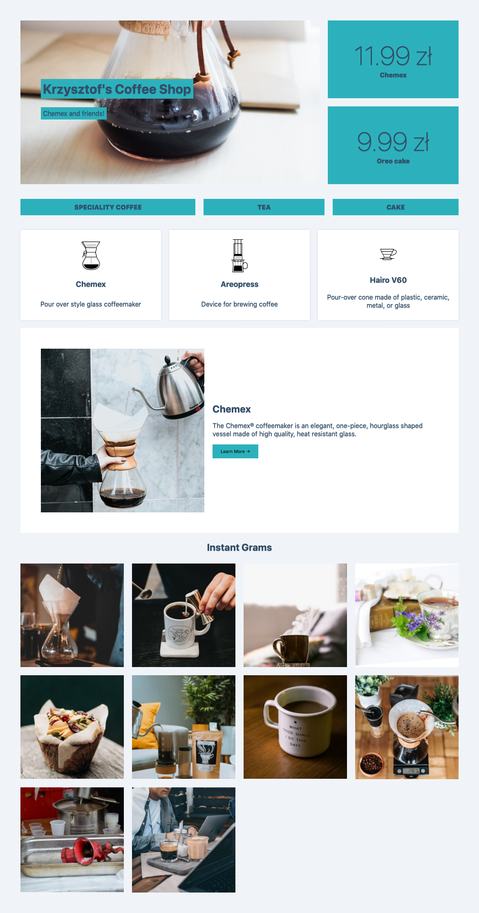

# CSS grid coffee shop

Sample project to play with CSS Grid.



## Installation & usage

```shell
npm install
```

```shell
npm start
```

## Inspiration & Credits

Heavily inspired by [CSS Grid](https://cssgrid.io/) course by [Wes Bos](https://thenounproject.com/).

Icons by [Eric M. Ellis](https://thenounproject.com/ericellis/) from the [Noun Project](https://thenounproject.com/).

## What I learned

How to do layout using CSS grid.

## Codepen

<p class="codepen" data-height="533" data-theme-id="dark" data-default-tab="html,result" data-user="krzysztofzuraw" data-slug-hash="zYGJXrR" style="height: 533px; box-sizing: border-box; display: flex; align-items: center; justify-content: center; border: 2px solid; margin: 1em 0; padding: 1em;" data-pen-title="CSS Grid Coffee Shop">
  <span>See the Pen <a href="https://codepen.io/krzysztofzuraw/pen/zYGJXrR">
  CSS Grid Coffee Shop</a> by Krzysztof Żuraw (<a href="https://codepen.io/krzysztofzuraw">@krzysztofzuraw</a>)
  on <a href="https://codepen.io">CodePen</a>.</span>
</p>
<script async src="https://static.codepen.io/assets/embed/ei.js"></script>
